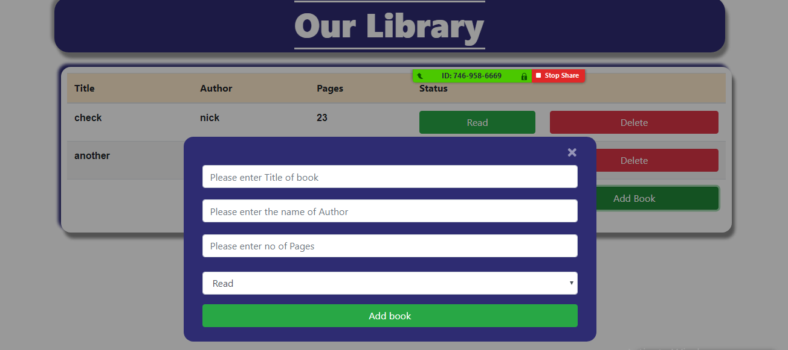
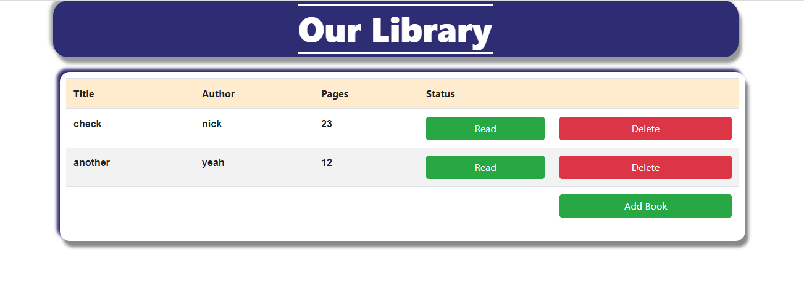

# Library

> Building a book store library using vanilla Javascript. In this project, we demostrate the use of Object and Object Constructor

## Features
The user can:
1. Add a book
2. Delete a book
3. Change status from Read to Unread and vice versa

The books are stored in browser's localStorage

## Screenshots

### Big Screen with pop up form


### Big Screen


### Medium Screen


### Small Screen


## Built With

- HTML,
- Bootstrap,
- CSS,
- Javascript

## Live Demo

[Live Demo Link](https://raw.githack.com/addod19/BookStoreLibrary/library/index.html)


## Getting Started

To get a local copy up and running follow these simple example steps.

1. ``` git clone https://github.com/addod19/BookStoreLibrary.git ```
2. Open the project with your favorite browser
3. Enjoy the beauty of the project

### Prerequisites

- A modern browser

## Authors

👤 **Author1**

- Github: [@addod19](https://github.com/addod19)
- Twitter: [@DanielLarbiAdd1](https://twitter.com/DanielLarbiAdd1)
- Linkedin: [Daniel Larbi Addo](https://linkedin.com/in/daniel-larbi-addo-9738b0128/)
- Email: (addodaniellarbi@gmail.com)

👤 **Author2**

- Github: [@macnick](https://github.com/macnick)
- Twitter: [@mac_experts](https://twitter.com/mac_experts)
- Linkedin: [Nick Haralampopoulos](https://www.linkedin.com/in/nick-haralampopoulos-26a55412a/)
## 🤝 Contributing

Contributions, issues and feature requests are welcome!

Feel free to check the [issues page](https://github.com/addod19/BookStoreLibrary/issues).


1. Fork it (https://github.com/addod19/BookStoreLibrary/fork)
2. Create your feature branch (git checkout -b my-new-feature)
3. Commit your changes (git commit -am 'Add some feature')
4. Push to the branch (git push origin my-new-feature)
5. Create a new Pull Request

## Show your support

Give a ⭐️ if you like this project!

## Acknowledgments

- Hat tip to anyone whose code was used
- Inspiration
- etc

## 📝 License

This project is [MIT](lic.url) licensed.
